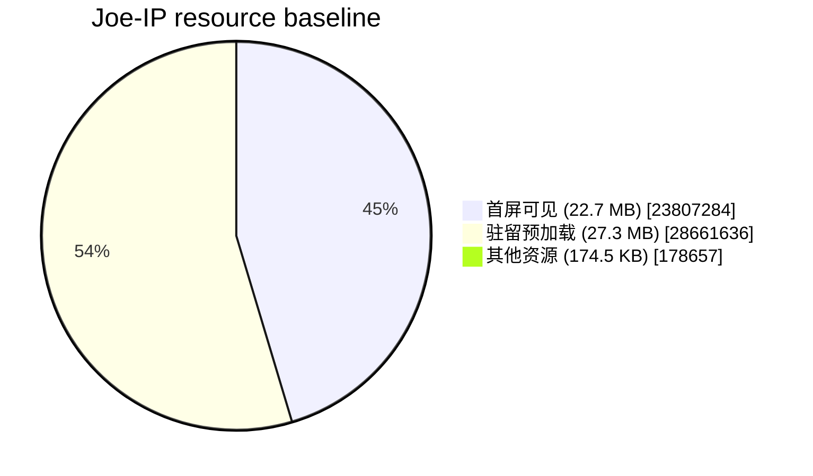

# Joe-IP Asset Baseline

生成时间：2026-08-29T21:01:15.739Z

> 这是源文件体积报告，不等同于浏览器实际传输量。浏览器缓存、压缩和视频 Range 请求需要在 Network 面板单独验证。

## 总览

| 指标 | 大小 | 占项目源文件 | 说明 |
|---|---:|---:|---|
| 首屏可见资源 | 22.7 MB | 45.2% | Home 必须显示的代码和 Scene 1 素材 |
| 首屏驻留预加载 | 27.3 MB | 54.4% | 停留 Home 时准备的 Scene 2–4 图片和视频 |
| Scene 1 | 22.3 MB | 44.5% | 按路径归属的全部资源 |
| Scene 2 | 7.74 MB | 15.4% | 按路径归属的全部资源 |
| Scene 3 | 12.8 MB | 25.4% | 按路径归属的全部资源 |
| Scene 4 | 6.87 MB | 13.7% | 按路径归属的全部资源 |
| Scene 5 | 1.23 KB | 0.0% | 按路径归属的全部资源 |
| Scene 6 | 1.54 KB | 0.0% | 按路径归属的全部资源 |
| Scene 7 | 1.46 KB | 0.0% | 按路径归属的全部资源 |
| **全部源文件** | **50.2 MB** | **100.0%** | 排除 node_modules、dist、报告和临时目录 |

## 体积分布



饼图将资源分成三类：首屏可见资源、为保证后续播放流畅而在首屏驻留期间预加载的媒体，以及其他资源。

## 媒体资源

| Scene | 文件 | 类型 | 大小 |
|---:|---|---|---:|
| 1 | `scenes/scene-1/assets/grass-wireframe-c.png` | Image | 3.12 MB |
| 1 | `scenes/scene-1/assets/grass-wireframe-b.png` | Image | 3.12 MB |
| 1 | `scenes/scene-1/assets/grass-wireframe-a.png` | Image | 2.97 MB |
| 1 | `scenes/scene-1/assets/grass-2.png` | Image | 2.73 MB |
| 1 | `scenes/scene-1/assets/grass1-2.png` | Image | 2.68 MB |
| 1 | `scenes/scene-1/assets/grass2-2.png` | Image | 2.65 MB |
| 1 | `scenes/scene-1/assets/Background perspective-2.png` | Image | 1.70 MB |
| 1 | `scenes/scene-1/assets/Character perspective overlay-2.png` | Image | 1.20 MB |
| 1 | `scenes/scene-1/assets/character-main.png` | Image | 1.06 MB |
| 1 | `scenes/scene-1/assets/scene1-landscape-4k.png` | Image | 1.05 MB |
| 2 | `scenes/scene-2/assets/scene2-glasses.mp4` | Video | 7.46 MB |
| 2 | `scenes/scene-2/assets/scene2-poster.jpg` | Image | 275.9 KB |
| 3 | `scenes/scene-3/assets/scene3-pen.mp4` | Video | 9.33 MB |
| 3 | `scenes/scene-3/assets/scene3-poster.png` | Image | 3.42 MB |
| 4 | `scenes/scene-4/assets/scene4-screen.mp4` | Video | 5.14 MB |
| 4 | `scenes/scene-4/assets/scene4-poster.png` | Image | 1.72 MB |
|  | **媒体合计** |  | **49.6 MB** |

## 最大文件

| 文件 | 类型 | 大小 | 占全部源文件 |
|---|---|---:|---:|
| `scenes/scene-3/assets/scene3-pen.mp4` | Video | 9.33 MB | 18.6% |
| `scenes/scene-2/assets/scene2-glasses.mp4` | Video | 7.46 MB | 14.9% |
| `scenes/scene-4/assets/scene4-screen.mp4` | Video | 5.14 MB | 10.2% |
| `scenes/scene-3/assets/scene3-poster.png` | Image | 3.42 MB | 6.8% |
| `scenes/scene-1/assets/grass-wireframe-c.png` | Image | 3.12 MB | 6.2% |
| `scenes/scene-1/assets/grass-wireframe-b.png` | Image | 3.12 MB | 6.2% |
| `scenes/scene-1/assets/grass-wireframe-a.png` | Image | 2.97 MB | 5.9% |
| `scenes/scene-1/assets/grass-2.png` | Image | 2.73 MB | 5.4% |
| `scenes/scene-1/assets/grass1-2.png` | Image | 2.68 MB | 5.3% |
| `scenes/scene-1/assets/grass2-2.png` | Image | 2.65 MB | 5.3% |
| `scenes/scene-4/assets/scene4-poster.png` | Image | 1.72 MB | 3.4% |
| `scenes/scene-1/assets/Background perspective-2.png` | Image | 1.70 MB | 3.4% |

## 如何更新

```bash
npm run analyze:assets
```

报告文件：`reports/asset-baseline.md`。建议每次替换图片、重新编码视频或新增项目后重新生成，并用 `git diff -- reports/asset-baseline.md` 查看变化。
